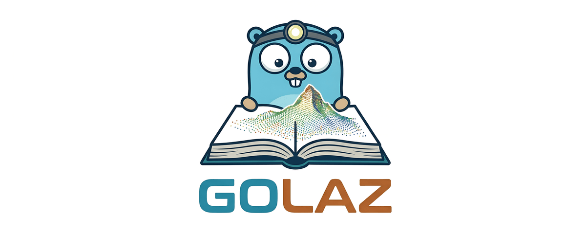

# GoLaz

### Read LAS and LAZ point clouds from pure Go — no CGO, no bindings, no fuss.

<p align="center">
  
</p>

---

## 📖 About GoLaz

GoLaz is a **pure Go** library for reading **LAS** and **LAZ** (compressed LAS) point cloud files. It is a port of the [LASzip](https://github.com/LASzip/LASzip) C++ library, rewritten from scratch in Go with no CGO, no C bindings, and no external native dependencies.

> **Unofficial port.** GoLaz is an independent community port and is not affiliated with or endorsed by rapidlasso GmbH, the authors of LASzip.

> **Disclaimer on AI usage**
> This project extensively used AI to accelerate the port of the original library. While the code has been reviewed and unit tested to cover most LAS/LAZ reading features, edge cases, bugs are possible. If so please cut an issue. Of course contributions are incredibly welcome!

### What it supports

| Feature | Details |
|---|---|
| **LAS versions** | 1.0 – 1.4, 1.5 (experimental) |
| **Point formats** | 0 – 10 |
| **Compression** | Uncompressed `.las` and LASzip-compressed `.laz` (all compressor variants: pointwise, chunked, layered; item versions 1 – 4) |
| **Compatibility mode** | Files written by `laszip -compatible` are transparently presented as native LAS 1.4 (disable with `WithCompatibilityMode(false)`) |
| **Extra bytes** | Named extra-byte attributes with typed access |
| **CRS metadata** | WKT (OGC), GeoTIFF key directory, `CRS()` helper |
| **Selective decode** | Skip unused layers for faster I/O on LAS 1.4 v3/v4 files |
| **Seeking** | Random-access seek to any point by index |
| **Corruption recovery** | Corrupt or missing chunk tables and damaged chunks are recovered like the C++ reference: healthy chunks remain readable |

GoLaz currently focuses on reading. Writing is not yet supported (but contributions are welcome).

## 📦 Installation

```bash
go get github.com/mfbonfigli/golaz
```

Requires Go 1.26 or later. No other dependencies.

## 🚀 Usage

### Opening a file

```go
import "github.com/mfbonfigli/golaz"

r, err := golaz.Open("scan.laz")
if err != nil {
    log.Fatal(err)
}
defer r.Close()
```

Pass an `io.ReadSeeker` instead of a path using `OpenReader`:

```go
f, _ := os.Open("scan.las")
r, err := golaz.OpenReader(f)
```

### Reading the header

```go
h := r.Header()

fmt.Println("LAS version:  ", h.VersionMajor, h.VersionMinor)
fmt.Println("Point format: ", h.PointDataFormat)
fmt.Println("Point count:  ", h.NumberOfPoints)
fmt.Println("Scale:        ", h.ScaleX, h.ScaleY, h.ScaleZ)
fmt.Println("Offset:       ", h.OffsetX, h.OffsetY, h.OffsetZ)
fmt.Println("Bounding box: ", h.MinX, h.MinY, h.MinZ, "→", h.MaxX, h.MaxY, h.MaxZ)
fmt.Println("Compressed:   ", h.IsCompressed)
```

### Reading points — `Scan` vs `Next`

GoLaz provides two methods for iterating over points.

**`Scan`** writes into a caller-provided `Point`, reusing the same memory on every call. This is the zero-allocation path and is the right choice for processing millions of points in a tight loop:

```go
var p golaz.Point
for {
    err := r.Scan(&p)
    if err == io.EOF {
        break
    }
    if err != nil {
        log.Fatal(err)
    }
    fmt.Printf("X=%.3f Y=%.3f Z=%.3f class=%d\n",
        p.X, p.Y, p.Z, p.Classification)
}
```

**`Next`** allocates and returns a new `*Point` on every call. The returned pointer is safe to hold indefinitely — subsequent `Next` or `Scan` calls will not overwrite it. Use `Next` when you need to collect points into a slice:

```go
var points []*golaz.Point
for {
    p, err := r.Next()
    if err == io.EOF {
        break
    }
    if err != nil {
        log.Fatal(err)
    }
    points = append(points, p)
}
```

#### Accessing point attributes

Universal fields are plain struct fields. Optional fields return `(value, bool)` — the bool is `false` when the field does not exist for this point format. Call the corresponding `Has*()` guard first in hot loops to skip the getter entirely:

```go
// Always present
fmt.Println(p.X, p.Y, p.Z)
fmt.Println(p.Intensity, p.Classification, p.ReturnNumber)

// Conditional — use Has* guard or inspect the bool return
if p.HasGPSTime() {
    gps, _ := p.GPSTime()
    fmt.Println("GPS time:", gps)
}
// or, alternatively:
if gps, hasGpsTime := p.GPSTime(); hasGpsTime {
    fmt.Println("GPS time:", gps)
}

if p.HasRGB() {
    red, green, blue, _ := p.RGB()
    fmt.Println("RGB:", red, green, blue)
}
// or, alternatively:
if red, green, blue, hasColor := p.RGB(); hasColor {
    fmt.Println("RGB:", red, green, blue)
}

if p.HasNIR() {
    nir, _ := p.NIR()
    fmt.Println("NIR:", nir)
}
// or alternatively:
if nir, hasNir := p.NIR(); hasNir {
    fmt.Println("NIR:", nir)
}

// LAS 1.4 extended fields (point formats 6–10)
if p.HasExtendedFields() {
    ch, _ := p.ScannerChannel()
    fmt.Println("Scanner channel:", ch)
}
// Waveform direction vector (point formats 4, 5, 9, 10)
if p.HasWavepacket() {
    xt, yt, zt, _ := p.WaveDirection()
    fmt.Println("Wave direction:", xt, yt, zt)
}
```

#### Named extra bytes

Files with a LASF_Spec extra-byte VLR expose named attributes:

```go
descs := r.ExtraByteDescriptors()
for _, d := range descs {
    fmt.Println(d.Name, d.DataType)
}

var p golaz.Point
r.Scan(&p)

val, err := r.ExtraByte(&p, "Confidence") // typed: float32, uint32, …
if err == nil {
    fmt.Println("Confidence:", val.(float32))
}
```

### Seeking

Jump to any point by zero-based index. Works for both compressed and uncompressed files:

```go
// Read point 5000 directly.
if err := r.Seek(5000); err != nil {
    log.Fatal(err)
}
var p golaz.Point
r.Scan(&p)

// Go back to the beginning.
r.Reset()
```

### Coordinate reference system metadata

#### WKT

```go
wkt := r.WKT() // nil if no WKT record
if wkt != nil {
    fmt.Println(wkt.CoordinateSystem)
}
```

#### GeoTIFF

```go
geo, err := r.GeoTIFF() // nil, nil if no GeoTIFF VLR
if err == nil && geo != nil {
    // Key 3072 = ProjectedCSTypeGeoKey
    if key, ok := geo.Keys[3072]; ok {
        fmt.Println("Projected EPSG:", key.AsShort())
    }
}
```

#### CRS — one-liner helper

`CRS()` inspects both WKT and GeoTIFF records and returns a single identifier string (WKT takes priority):

```go
fmt.Println(r.CRS()) // e.g. "EPSG:32632" or a full WKT string
```

#### VLRs and EVLRs

```go
for _, v := range r.VLRs() {
    fmt.Println(v.UserID, v.RecordID, len(v.Data), "bytes")
}

evlrs, err := r.EVLRs() // nil, nil for LAS < 1.4
```

### Selective decompression

LAS 1.4 files compressed with the layered compressor store each point attribute in a separate compressed layer. GoLaz can skip layers you don't need, reducing I/O and CPU work proportionally.

For uncompressed files and LAS 1.2/1.3 the mask is silently ignored — all attributes are always decoded.

```go
// Decode only elevation — skip GPS, colour, intensity, …
r, err := golaz.Open("dense.laz",
    golaz.WithSelectiveMask(golaz.SelectiveZ))

// Decode elevation and GPS time together.
r, err := golaz.Open("dense.laz",
    golaz.WithSelectiveMask(golaz.SelectiveZ | golaz.SelectiveGPSTime))

// Multiple WithSelectiveMask calls accumulate (OR):
r, err := golaz.Open("dense.laz",
    golaz.WithSelectiveMask(golaz.SelectiveZ),
    golaz.WithSelectiveMask(golaz.SelectiveGPSTime),
)
```

Available masks:

| Constant | Attribute(s) |
|---|---|
| `SelectiveAll` | Everything (default) |
| `SelectiveZ` | Elevation |
| `SelectiveGPSTime` | GPS timestamp |
| `SelectiveIntensity` | Intensity |
| `SelectiveRGB` | Red, Green, Blue |
| `SelectiveNIR` | Near-infrared |
| `SelectiveWavepacket` | Full-waveform data |
| `SelectiveClassification` | Classification byte |
| `SelectiveFlags` | Classification flags, scan direction, edge-of-flight-line |
| `SelectiveScanAngle` | Scan angle |
| `SelectiveUserData` | User data byte |
| `SelectivePointSource` | Point source ID |
| `SelectiveExtraBytes` | All extra byte channels |

> **Note:** the XY coordinates, scanner channel, and return information are always decoded regardless of the mask.


## 🐞 Reporting a bug

golaz is an AI-assisted porting that has been tested against a range of LAS and LAZ files. As with any other software, bugs are possible. If you encounter a file that cannot be properly read, or any other bug, please [open an issue](https://github.com/mfbonfigli/golaz/issues) and attach (or describe) the file, or share it privately with the library maintainers over separate channels (e.g. email).

## ☕ Support the Project

If golaz helped you or your business please consider **[making a donation](https://ko-fi.com/mfbonfigli)**. 

## 📄 License

GoLaz is released under the [Apache License 2.0](LICENSE).

The LASzip algorithm and the original C++ implementation are Copyright © 2007–2022 rapidlasso GmbH also licensed under the Apache License 2.0.

## 🙏 Credits

**GoLaz** was developed by [Massimo Federico Bonfigli](mailto:m.federico.bonfigli@gmail.com).

The decompression engine is a Go port of the [LASzip](https://github.com/LASzip/LASzip) library by rapidlasso GmbH. All credit for the underlying algorithm goes to the LASzip authors.
